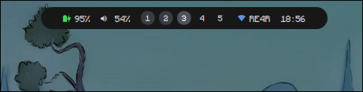
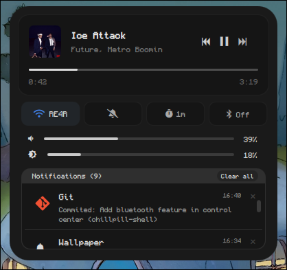
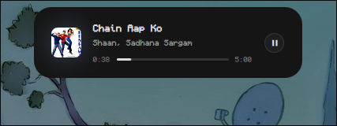
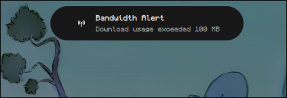
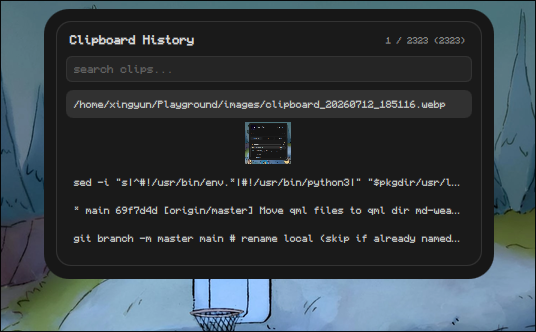
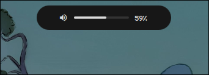
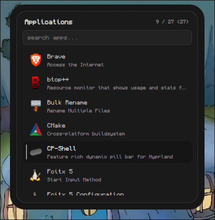
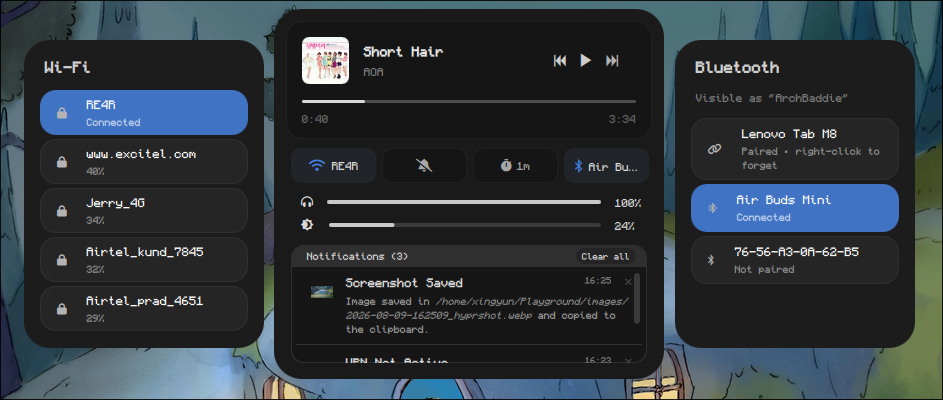
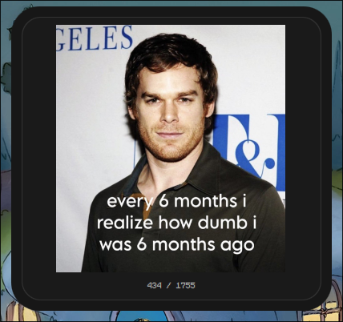

# notch-shell

> A Hyprland shell built with **Quickshell**: a hanging bar that hugs the screen
> edge, 38 themes, two screen-edge notches (running apps on the left, system
> tray on the right), and a mini dashboard. See
> [what is in this release](#whats-new-in-010).
>
> Originally forked from [ChillPill-Shell](https://github.com/LUCKYS1NGHH/ChillPill-Shell)
> by [LUCKYS1NGHH](https://github.com/LUCKYS1NGHH) — thank you for the original.
> GPL-3.0, as upstream.

<div align="center">

[](https://github.com/Kishan362/notch-shell)
[](https://github.com/Kishan362/notch-shell/stargazers)
[](https://github.com/quickshell-mirror/quickshell)
[](https://www.gnu.org/licenses/gpl-3.0)

notch-shell is a **lightweight**, feature-rich dynamic pill bar for Hyprland, built with **Quickshell**.
It's aimed squarely at users running without a dedicated GPU (like me) — eye candy that doesn't cost you a discrete card. Runs great on integrated graphics.

It runs as a **standalone app**: launch it from your terminal or app launcher when you want it, rather than having it baked
into your session at all times. It's not bound to any dotfiles.

</div>

<div align="center">

[](#resource-usage)
[](#showcase)
[](#features)
[](#configurable-options)
[](#custom-pill-modules)
[](#dependencies)
[](#install)
[](#auto-startup)
[](#key-bindings)
[](#whats-new-in-010)
[](#contributors)

</div>

---

### Resource Usage

- RAM: 200-500 MB (Average 380)
- CPU: Idle 0%, Average 3%, Min 0.1%, Max 10%
- GPU: Idle 0%, Average 15%, Min 6%, Max 45%

> CPU and GPU usage varies with system. a better CPU and GPU use less.

#### My Hardware

- RAM: 8GB (DDR3)
- CPU: i5 3337U (Dual-core)
- GPU: Intel HD 4000 (Integrated)

---

### Showcase

[Watch the demo on YouTube](https://www.youtube.com/watch?v=t7ydMT4F478)

<table>
  <tr>
    <td width="50%">
      <p align="center"><b>Main pill bar</b></p>
      
    </td>
    <td width="50%">
      <p align="center"><b>Control center</b></p>
      
    </td>
  </tr>
  <tr>
    <td width="50%">
      <p align="center"><b>Media playing popup</b></p>
      
    </td>
    <td width="50%">
      <p align="center"><b>Notification popup (nusgmon-alert)</b></p>
      
    </td>
  </tr>
  <tr>
    <td width="50%">
      <p align="center"><b>Cliphist (clipboard manager)</b></p>
      
    </td>
    <td width="50%">
      <p align="center"><b>Mini dashboard — calendar</b></p>
      
    </td>
  </tr>
  <tr>
    <td width="50%">
      <p align="center"><b>Mini dashboard — weather</b></p>
      
    </td>
    <td width="50%">
      <p align="center"><b>Volume OSD (has more OSDs like brightness, battery, timer)</b></p>
      
    </td>
  </tr>
  <tr>
    <td width="50%">
      <p align="center"><b>App launcher</b></p>
      
    </td>
    <td width="50%">
      <p align="center"><b>Control center — Wifi and Bluetooth panel</b></p>
      
    </td>
  </tr>
  <tr>
    <td width="50%">
      <p align="center"><b>Wallpaper switcher</b></p>
      
    </td>
    <td width="50%">
      <p align="center"><b>Cliphist — Full preview tab (Image; Text also supports)</b></p>
      
    </td>
  </tr>
</table>

## Features

- **Main Pill Bar**                - Battery, volume, workspaces, network, clock (default; customizable) — for more module options, see 'Know more' below.
- **Control Center**               - Media player, buttons (WiFi, Silent Notifs, Timer, Bluetooth), volume & brightness sliders, notification stack
- **Cliphist (Clipboard Manager)** - Search, clipboard image preview, item index status, `Delete` key to delete any item, `Tab` to full preview the clipboard image/text
- **Mini Dashboard**               - Profile image, username, hostname, uptime, battery, basic network info, today's data usage, datetime, weather, calendar, power buttons (lock, sleep, shutdown, reboot)
  - **Calendar Popup**             - Previous/Next month buttons, event dates
  - **Weather Popup**              - Feel, humidity, wind, sunrise & sunset, upcoming 2 days weather forecast, manual refresh button
- **DBus Notification**            - App icon (optional), summary, body (YES! you can ditch swaync/dunst fully now)
- **OSD**                          - Battery, volume, brightness, timer
- **Wallpaper switcher**           - A wallpaper switcher
- **Power Menu**                   - Dedicated power pill state with 5 actions (Lock, Sleep, Logout, Restart, Shutdown) and action confirmation prompt

<details>
<summary>Know more</summary>

---
- Main pill bar modules has tooltips

- Extra modules available for the pill bar beyond the defaults: `weather`, `bluetooth`, `vpn`, `notifications`, `brightness`

- Pill bar supports custom modules (waybar-style) — run any command/script in the bar with `format`/`tooltip` templates, refresh intervals, streaming output and click actions (see [Custom pill modules](#custom-pill-modules)).

- 3 pill states are open-able with mouse:

  - Control center: `Left click`
  - Cliphist: `Middle click`
  - Mini Dashboard: `Right click`

  For the rest of states, you have to call the IPC through keybinds in Hyprland, which are provided in [Keybinds](#key-bindings)
  section (including the mouse open-able states)

- DPI and Pill scaling is available in the config if you need it.

- Audio, workspaces, bluetooth and wifi in pill bar are clickable.

- Control center's media player progress bar is not only for status, it's usable to control the media you playing.
  also timer minutes can be change by right click and hold-to-burst (stop) it when running.

- Control center has WiFi controller (panel) which has list of active networks and has password prompt.

- The wifi panel also includes the USB tethering toggle.

- Control center has also Bluetooth controller which has list of active, pair & connected devices/networks, device battery. here's 3 cases to connect a bluetooth device first time:

  - case 1: device wants a PIN or passkey typed in
  - case 2: device just wants us to display a code
  - case 3: device wants a yes/no confirmation of a shown passkey

- Cliphist shows image previews from `~/.cache/notch-shell/cliphist-imgs` by converting image binaries into real images and save there. if
  you want these images cache to auto delete when you delete the cliphist (clipboard manager) image item, then there's `deleteCliphistImgCache` config
  option (enabled by default).

- In Cliphist full preview tab (which opens through `Tab` key), you can switch to other item by `Up`/`Down` keys, and can also delete the item from there.

- Notifications are able to show in slide animation (similar to iOS mute) while you playing video game or watching movie in full screen.
  also it can show custom app icon to show in notification, else it shows bell icon.

- CPU usage and temperature in the mini dashboard, with a per-core breakdown on
  click. Replaces the data-usage readout that used to sit there.

- Wallpaper switcher shows you the filename of the image on hover. uses `awww` in backend to update the wallpaper by default (optional dep).
---
</details>

## What's new in 0.1.0

Upstream work is credited to [LUCKYS1NGHH](https://github.com/LUCKYS1NGHH);
this is a fork of [ChillPill-Shell](https://github.com/LUCKYS1NGHH/ChillPill-Shell)
under the same GPL-3.0 licence, rebranded to **notch-shell** and developed
independently on `main`.

### What changed

**CPU stats in the mini dashboard.** Replaces the data-usage readout on the
right. Overall utilisation and package temperature at all times; click (or
right click) the readout for a per-core breakdown with a bar each, and the bar
turns red past 85%. Usage is read from `/proc/stat` through a `FileView`, so a
refresh costs one small read rather than a process spawn, and percentages are
computed as deltas between samples. The temperature comes from `lm_sensors` and
hides itself if that is not installed.

**Click-to-pick profile picture.** Click the avatar in the mini dashboard to
choose an image. It is downscaled to 256x256 (EXIF rotation applied, centre
cropped so the circular avatar does not letterbox) and cached, then
`displayPicture` is repointed at it. `scripts/set_config.py` edits that single
key in place, so your comments and formatting survive, and the shell picks the
change up without a restart. The script rewrites the file rather than replacing
it, because `Config.qml` watches the path and a rename would move that watch
onto a deleted inode; it also leaves a `config.jsonc.bak` beside your config.
ImageMagick does the resize; without it the picked file is used where it lies,
just not shrunk.

**Two screen-edge notches.** A pill in the **bottom-left** corner lists every
open window, taskbar style, grouped by app with a count badge and a dot on the
focused one. A matching pill in the **bottom-right** lists system tray icons.
Both are icon-only, hide themselves when there is nothing to show, and size
their window to their content so the transparent surface never steals clicks.
The tray host is quickshell itself, so no separate tray daemon is needed.

**Right-click menus on both.** On the apps notch, a right click replaces the
panel with per-window actions: focus, float, pin, fullscreen, copy title, and
close. On the tray notch, a right click shows the **app's own** menu, drawn in
the shell's styling — the real DBusMenu the application publishes, including
separators, disabled entries, checkable items and nested submenus. Left click
still activates.

**Light themes are readable.** Fourteen hardcoded near-white text colours were
invisible on a light bar, several below 1.2:1 contrast. Every module now reads
from the theme system through a semantic token layer (`okFg`, `infoFg`,
`dangerFg`, `warnFg`, `onAccent`), so status colours work on both polarities
from a single anchor per theme.

**Themes.** 38 palettes in `qml/ThemePalettes.qml`, each declared as ~12
anchor colours that `qml/ThemeRamp.qml` expands into the full property set, so
ramps stay monotonic and consistent across light and dark themes. `default`
keeps the upstream greys byte-for-byte. `Theme.qml` is a dispatcher, so every
existing `Theme.*` call site is untouched. `ThemePicker.qml` plus a
`themePicker` IPC target give a live picker; the `theme` key in `config.jsonc`
is watched, so changes apply without a restart. <kbd>Super</kbd>+<kbd>T</kbd>.

**Hanging bar.** The bar attaches to the top edge with square top corners and
rounded bottom, in every state, using per-corner radii (Qt >= 6.7).

**Mic module.** `Mic.qml` against `Pipewire.defaultAudioSource`, with a slider
in the control centre. The volume percentage was removed from the speaker
module — the glyph already encodes level and mute.

**Wifi indicator and separators.** New `Wifi.qml` (signal tiers, no SSID) and
`Separator.qml`; `network` is untouched for anyone who wants the name inline.
Bar order: `wifi · battery · │ · volume mic · │ · workspaces · │ · clock`.

**Weather location picker.** Click the city name in the weather popup to
search. Results are disambiguated via Open-Meteo geocoding, and a pick stores
both a readable name and `lat,lon` so later fetches are exact. A crosshairs
button detects by IP. `scripts/set_config.py` writes the config in place,
preserving comments.

**Notification sound.** `scripts/make_notification_sound.py` synthesises the
chime rather than shipping a binary blob.

### Bugs fixed along the way

- `pillTopMargin: 0` was silently ignored on cold start, stranding the bar 9px
  below the screen edge: wlr-layer-shell never re-applies a margin change *to
  zero*, so the surface kept the position it was first committed with.
- The control centre clipped the brightness slider when media was playing, as
  the with-player height did not account for a third slider row.
- Firefox never publishes `mpris:length`, and Quickshell's `MprisPlayer.length`
  then mirrors position — so the media card printed the elapsed time on both
  sides and the seek bar sat permanently full. It now shows `--:--` when the
  length is genuinely unknown.
- Escape closes any open overlay, stepping back one level in the location
  editor first. The power menu is excluded because its Escape is two-stage.

### Key bindings

The shell's panels are all opened from keys. Bind them in your Hyprland config
(`hyprland.lua` if you use the Lua config):

```lua
hl.bind(mainMod .. " + C", hl.dsp.exec_cmd("qs ipc -p /usr/share/notch-shell call controlCenter toggle"))
hl.bind(mainMod .. " + V", hl.dsp.exec_cmd("qs ipc -p /usr/share/notch-shell call cliphist toggle"))
hl.bind(mainMod .. " + R", hl.dsp.exec_cmd("qs ipc -p /usr/share/notch-shell call appLauncher toggle"))
hl.bind(mainMod .. " + W", hl.dsp.exec_cmd("qs ipc -p /usr/share/notch-shell call wallpaperSwitcher toggle"))
hl.bind(mainMod .. " + T", hl.dsp.exec_cmd("qs ipc -p /usr/share/notch-shell call themePicker toggle"))
hl.bind(mainMod .. " + Y", hl.dsp.exec_cmd("qs ipc -p /usr/share/notch-shell call weather toggle"))
hl.bind(mainMod .. " + Escape", hl.dsp.exec_cmd("qs ipc -p /usr/share/notch-shell call powerMenu toggle"))
```

| Target | Default | Opens |
| --- | --- | --- |
| `controlCenter` | <kbd>Super</kbd>+<kbd>C</kbd> | Control centre |
| `cliphist` | <kbd>Super</kbd>+<kbd>V</kbd> | Clipboard manager |
| `appLauncher` | <kbd>Super</kbd>+<kbd>R</kbd> | App launcher |
| `wallpaperSwitcher` | <kbd>Super</kbd>+<kbd>W</kbd> | Wallpaper switcher |
| `themePicker` | <kbd>Super</kbd>+<kbd>T</kbd> | **Theme picker** |
| `weather` | <kbd>Super</kbd>+<kbd>Y</kbd> | **Weather popup** |
| `powerMenu` | <kbd>Super</kbd>+<kbd>Esc</kbd> | Power menu |
| `miniDashboard` | unbound | System info; also right-click the bar |

Every target accepts `show` and `hide` as well as `toggle`.

The `weather` target is new here. Without a bind, the popup is still reachable
by right-clicking the bar and clicking the weather in the mini dashboard.

**Escape closes any open panel.** In the location picker it steps back one level
first; the power menu instead cancels a pending confirmation on the first press,
which is deliberate.

Three features need no binding at all: click the **city name** to
change location, click the **mic icon** to mute, click the **wifi icon** to
toggle Wi-Fi. Hovering any bar module shows a tooltip.

### Building

Built from source with a local PKGBUILD rather than the AUR package, so
`build.sh` regenerates `pkgver` and the checksum from the clone, then calls
`makepkg`:

```bash
~/Projects/notch-shell-custom/build.sh -i
```

### Known limitations

- Decorative hues whose meaning is the hue itself (the sun/rain weather icons,
  the power-menu action accents) stay literal. They're mid-tone so they read on
  any bar, and `scripts/validate_themes.py` proves each clears 3:1 against the
  lightest and darkest backgrounds in the set.
- IP location detection reflects how your ISP routes you, so treat it as a
  starting point — the search box is the reliable path.
- Three Qt warnings remain that are not attributable to this code:
  `qt.svg.draw` (an oversized icon request at startup), a `QIODevice::read` on
  an HTTP socket when a request is torn down, and an `iwd` D-Bus probe.

## Configurable options
> Located at `~/.config/notch-shell/config.jsonc`

| Option | Description | Default |
|---|---|---|
| `displayPicture` | Profile image path for mini dashboard, also settable by clicking the avatar | *(none)* |
| `clockFormat` | Clock format for the pill bar | `hh:mm` |
| `pillTopMargin` | Top spacing of pill bar | `9` |
| `pillBottomMargin` | Bottom spacing of pill bar | `26` |
| `pillScale` | Scale factor for pill bar size | `1.0` |
| `pillModules` | Pill bar modules order/add/remove. Accepts built-in module names or custom module (see [Custom pill modules](#custom-pill-modules)) | `["battery", "volume", "workspaces", "network", "clock"]` |
| `pillOnHover` | Auto hide the pill bar and only show on hover | `false` |
| `dpiScale` | DPI Scaling | `1.0` |
| `textFontFamily` | Font family for general text | `Monocraft` |
| `nerdFontFamily` | Font family for icons (Nerd Fonts) | `JetBrainsMono Nerd Font Propo` |
| `timerPresets` | Timer minute presets | `[1, 5, 10, 15, 30]` |
| `mediaPopupDuration` | Media-playing popup duration (ms) | `2000` |
| `maxWorkspaces` | Max workspaces shown in pill bar | `5` |
| `notificationDisplayTime` | Notification popup duration (ms) | `3000` |
| `maxNotificationsInStack` | Max notifications shown in stack | `20` |
| `avoidDuplicateNotifications` | Skip appending duplicate notifications to stack | `true` |
| `dataUsageRefreshInterval` | Data usage refresh interval (ms) | `300000` (5 min) |
| `screenLockAppCommand` | Screen lock command for mini dashboard's lock button | `hyprlock` |
| `osdDuration` | OSD (on-screen display) duration (ms) | `800` |
| `weatherLocation` | City for weather widget | `Delhi` |
| `weatherQuery` | Optional precise `lat,lon` used instead of the city string. Set by the location picker; leave empty to use `weatherLocation` | `""` |
| `weatherUnits` | Temperature units: `metric` (°C) or `imperial` (°F) | `metric` |
| `weatherRefreshInterval` | Weather refresh interval (ms) | `3600000` (1 hr) |
| `defaultTerminal` | Terminal used to open TUI apps from launcher | `kitty` |
| `wallpapersDir` | Wallpapers directory for wallpaper switcher | `~/Pictures/wallpapers` |
| `wsCloseOnWallpaperSet` | Close wallpaper switcher after apply wallpaper | `true` |
| `wsAnimation` | Wallpaper switcher open animation | `true` |
| `deleteCliphistImgCache` | Delete cached image file on clipboard entry removal, disabled keeps it on disk | `true` |
| `country` | Country for calendar events. accepts country name (India) or ISO 3166-1 alpha-2 (IN) but recommended is country code | `IN` |
| `showAudioVisuals` | Show audio visuals in media player (depends on cava) | `true` |
| `showSensitiveInfo` | Show sensitive VPN info in tooltip (IP, server, region, uptime) | `true` |
| `customWallpaperScript` | Use your own wallpaper script with {path} placeholder | `""` |
| `confirmPowerActions` | Prompt for confirmation before critical power actions (Shutdown, Restart, Logout) | `true` |
| `maxVolume` | Max volume the slider can reach | `100` |
| `separatePreviewTabTypes` | Skip a different item type (image,text) when switching in clipboard manager preview tab | `true` |
| `theme` | Name of the colour theme to use, see [Themes](#themes) | `nord` |

<details>
<summary>Raw config example</summary>

```jsonc
{
  "displayPicture": "",
  "clockFormat": "hh:mm",
  "pillTopMargin": 9,
  "pillBottomMargin": 26,
  "pillModules": ["battery", "volume", "workspaces", "network", "clock"],
  "pillOnHover": false,
  "textFontFamily": "Monocraft",
  "nerdFontFamily": "JetBrainsMono Nerd Font Propo",
  "timerPresets": [1, 5, 10, 15, 30],
  "mediaPopupDuration": 2000,
  "maxWorkspaces": 5,
  "notificationDisplayTime": 3000,
  "maxNotificationsInStack": 20,
  "dataUsageRefreshInterval": 300000,
  "screenLockAppCommand": "hyprlock",
  "osdDuration": 800,
  "weatherLocation": "Delhi",
  "weatherUnits": "metric",
  "weatherRefreshInterval": 3600000,
  "avoidDuplicateNotifications": true,
  "defaultTerminal": "kitty",
  "pillScale": 1.0,
  "dpiScale": 1.0,
  "wallpapersDir": "~/Pictures/wallpapers",
  "wsCloseOnWallpaperSet": true,
  "wsAnimation": true,
  "customWallpaperScript": "",
  "deleteCliphistImgCache": true,
  "country": "IN",
  "showAudioVisuals": true,
  "showSensitiveInfo": true,
  "confirmPowerActions": true,
  "maxVolume": 100,
  "separatePreviewTabTypes": true,
  "theme": "nord"
}
```

</details>

### Themes

The colour scheme is driven by a `theme` key in `config.jsonc`. Because the config
is watched, changing it restyles the bar immediately — no restart needed.

Press `SUPER + T` to open the theme picker:

```
hl.bind(mainMod .. " + T", hl.dsp.exec_cmd("qs ipc -p /usr/share/notch-shell call themePicker toggle"))
```

Available themes:

| Key | Name | | Key | Name |
| --- | --- | --- | --- | --- |
| `default` | Default (upstream greys) | | `tokyo-night-storm` | Tokyo Night Storm |
| `nord` | Nord | | `tokyo-night-light` | Tokyo Night Light |
| `nord-light` | Nord Light | | `dracula` | Dracula |
| `gruvbox` | Gruvbox | | `rose-pine` | Rosé Pine |
| `gruvbox-light` | Gruvbox Light | | `rose-pine-dawn` | Rosé Pine Dawn |
| `catppuccin-mocha` | Catppuccin Mocha | | `everforest` | Everforest |
| `catppuccin-macchiato` | Catppuccin Macchiato | | `kanagawa` | Kanagawa |
| `catppuccin-frappe` | Catppuccin Frappé | | `ayu-mirage` | Ayu Mirage |
| `catppuccin-latte` | Catppuccin Latte | | `one-dark` | One Dark |
| `tokyo-night` | Tokyo Night | | `solarized-dark` | Solarized Dark |
| `material-ocean` | Material Ocean | | `monokai` | Monokai |
| `github-dark` | GitHub Dark | | `github-light` | GitHub Light |
| `vitesse-dark` | Vitesse Dark | | `vitesse-light` | Vitesse Light |
| `ayu-dark` | Ayu Dark | | `ayu-light` | Ayu Light |
| `nightfox` | Nightfox | | `dayfox` | Dayfox |
| `material-palenight` | Material Palenight | | `material-light` | Material Light |
| `builtin-dark` | Builtin Dark | | `builtin-light` | Builtin Light |
| `solarized-light` | Solarized Light | | `rose-pine-moon` | Rosé Pine Moon |
| `one-light` | One Light | | `gruvbox-hard` | Gruvbox Hard |

Palettes live in `qml/ThemePalettes.qml`. Each theme declares only a handful of
anchor colours (`base`, `raised`, `high`, `text`, `muted`, `faint`, `accent`,
`warning`, `danger`, `glow`, `ok`, `info`); `qml/ThemeRamp.qml` expands those into
the full set of ramps, so themes stay internally consistent. To add one, copy an
existing block, give it a new key, and set its `label` and `light` fields.

`scripts/validate_themes.py` replicates the derivation in Python and checks every
palette for contrast and ramp consistency; run it after adding a theme.

### Changing the weather location

Click the city name in the weather popup to open the location picker. Type to
search, and pick from the disambiguated results (searching `Delhi` offers
Delhi in India as well as the several in the US). The crosshairs button
detects your location from your IP address.

A pick writes two keys: `weatherLocation` keeps a readable name for the UI,
and `weatherQuery` stores the coordinates so later fetches never have to
re-guess. With no `weatherQuery`, the widget falls back to using
`weatherLocation` as before.

IP detection reflects how your ISP routes you, so it is a starting point
rather than gospel - which is why the search box is there too.

The popup can also be opened from outside:

```
qs ipc -p /usr/share/notch-shell call weather toggle
```

### Custom Pill Modules

Besides the built-in Quickshell modules (`battery`, `workspaces`, `network`, `clock`, `vpn`, `notifications` etc.), `pillModules` also accepts
**object entries** that run any command/script and show its output in the bar — kind of similar to
[waybar's custom module](https://github.com/Alexays/Waybar/wiki/Module:-Custom).

| Key | Description |
|---|---|
| `run` | Command to execute **(required)**. A leading `~` is expanded to `$HOME`. |
| `icon` | Optional nerdfont icon, referenced in `format`/`tooltip` as `{icon}` |
| `format` | Text shown in the bar. Supports `{text}` / `{tooltip}` / `{icon}` placeholders. Default: `{icon} {text}` (or just `{text}` without an icon) |
| `tooltip` | Tooltip shown on hover. Supports `{text}` / `{tooltip}` / `{icon}` placeholders. Default: the output's tooltip |
| `every` | Refresh every N seconds. Omit (or `0`) to run once at startup |
| `stream` | Keep the process running and update the module on every stdout line (`true`) |
| `click` | Command run on left click |

The command may print **plain text** (used as `{text}`) or a **JSON object** per run / per line:

```json
{ "icon": "", "color": "#6d9fd7", "text": "45°C", "tooltip": "45°C CPU Temperature" }
```

`text` is required; `tooltip`, `color` and `icon` are optional. single `{text}` in JSON output fills the `{tooltip}` same.

A sample script ship in the repo and get installed to
`~/.config/notch-shell/modules/`: `cpu-temp.sh` (one-shot CPU temperature,
prints a temperature-dependent `{icon, color, text, tooltip}` JSON line).
Use your custom scripts to see specific/niche info in notch-shell's Pill Bar.

Example `pillModules`:

```jsonc
"pillModules": [
  "battery", "volume", "workspaces", "notifications", "network", "clock",
  {
    "run": "~/.config/notch-shell/modules/cpu-temp.sh", // required - rest are optional
    "format": "{icon} {text}",
    "tooltip": "{tooltip}",
    "every": 10
  }
]
```

## Dependencies
> [!NOTE]
> Currently it's tested only on: **Arch Linux** and **NixOS** + **Hyprland**.
> Packages below are Arch's; find the equivalent for your distro.

- [cliphist](https://github.com/sentriz/cliphist)
- [lm_sensors](https://github.com/lm-sensors/lm-sensors) (`lm_sensors` on Arch) CPU temperature for the dashboard readout
- [inotify-tools](https://github.com/inotify-tools/inotify-tools)
- [brightnessctl](https://github.com/Hummer12007/brightnessctl)
- [wl-clipboard](https://github.com/bugaevc/wl-clipboard)
- [pipewire](https://github.com/PipeWire/pipewire)
- [blueman](https://github.com/blueman-project/blueman)
- Qt Multimedia (`qt6-multimedia` on Arch)

> [!TIP]
> `install.sh` auto-installs all of the above for Arch users, **except** these optional packages:

- Monocraft Font (`ttf-monocraft-git` / `ttf-monocraft-nerd` on AUR)
- JetBrainsMono Nerd Font (`ttf-jetbrains-mono-nerd` on Arch)
- `qt6-imageformats` (on Arch) more image format support (e.g. WEBP) for wallpaper previews
- `holidays` (Python lib) event dates in calendar; `install.sh` prompts to install this one
- **ImageMagick** (`imagemagick`) only needed to downscale a profile picture you
  pick by clicking the avatar. Without it the picture still works, it is just
  not resized
- `cava` for showing audio visuals in media player
- `awww` for wallpaper switcher if you don't use custom wallpaper script

## Install

> [!TIP]
> Use my Hyprland [dotfiles](https://github.com/LUCKYS1NGHH/dotfiles), it's also made for No Dedicated GPU machines.
> You will get more better performance.

#### Arch users (AUR)

```bash
paru -S notch-shell
```

#### NixOS users (flake with Home Manager)

Add this repository as an input to your flake:

```nix
{
  inputs = {
    notch-shell = {
      url = "github:LUCKYS1NGHH/notch-shell";
      inputs.nixpkgs.follows = "nixpkgs";
    };
  };
}
```

Enable and configure it in your Home Manager configuration:

```nix
{ notch-shell, ... }:
{
  imports = [
    notch-shell.homeManagerModules.default
  ];

  programs.notch-shell = {
    enable = true;
    settings = {
      clockFormat = "HH:mm";
      # Other options from config.jsonc
    };
  };
}
```

#### Other
```bash
git clone --depth=1 https://github.com/Kishan362/notch-shell.git
cd notch-shell
chmod +x install.sh
sudo ./install.sh # use --skip-deps to skip dependencies installation (arch currently)
```

<details>
<summary>Uninstall?</summary>

---

#### AUR
```bash
paru -R notch-shell
```

#### Other
```bash
chmod +x uninstall.sh
sudo ./uninstall.sh
```

---
</details>

### Auto startup

To auto-run at every time you start your Hyprland, paste this code in your `~/.config/hypr/hyprland.lua` config file

```lua
hl.on("hyprland.start", function()
   hl.exec_cmd("notch-shell")
end)
```

## Key Bindings

Keybindings are highly recommended for notch-shell in your Hyprland, Just paste this code in your Hyprland (Lua) config file.

> Adjust key combinations by your preferences

```lua
hl.bind(mainMod .. " + CTRL + C",  hl.dsp.exec_cmd("qs ipc -p /usr/share/notch-shell call controlCenter toggle"))
hl.bind(mainMod .. " + CTRL + V",  hl.dsp.exec_cmd("qs ipc -p /usr/share/notch-shell call cliphist toggle"))
hl.bind(mainMod .. " + CTRL + B",  hl.dsp.exec_cmd("qs ipc -p /usr/share/notch-shell call miniDashboard toggle"))
hl.bind(mainMod .. " + D", hl.dsp.exec_cmd("qs ipc -p /usr/share/notch-shell call appLauncher toggle"))
hl.bind(mainMod .. " + W", hl.dsp.exec_cmd("qs ipc -p /usr/share/notch-shell call wallpaperSwitcher toggle"))
hl.bind(mainMod .. " + Escape", hl.dsp.exec_cmd("qs ipc -p /usr/share/notch-shell call powerMenu toggle"))
```

<details>
<summary>NixOS version</summary>

```lua
hl.bind(mainMod .. " + CTRL + C",  hl.dsp.exec_cmd("notch-shell-ipc call controlCenter toggle"))
hl.bind(mainMod .. " + CTRL + V",  hl.dsp.exec_cmd("notch-shell-ipc call cliphist toggle"))
hl.bind(mainMod .. " + CTRL + B",  hl.dsp.exec_cmd("notch-shell-ipc call miniDashboard toggle"))
hl.bind(mainMod .. " + D", hl.dsp.exec_cmd("notch-shell-ipc call appLauncher toggle"))
hl.bind(mainMod .. " + W", hl.dsp.exec_cmd("notch-shell-ipc call wallpaperSwitcher toggle"))
hl.bind(mainMod .. " + Escape", hl.dsp.exec_cmd("notch-shell-ipc call powerMenu toggle"))
```
</details>

---


### Contributors

Thanks to the contributors who helped make the shell better, and special thanks to [enhaoswen](https://github.com/enhaoswen) for the Wi-Fi controller backend for Quickshell.

<a href="https://github.com/LUCKYS1NGHH/ChillPill-Shell/graphs/contributors">
  
</a>

### Author

LUCKYS1NGHH / https://github.com/LUCKYS1NGHH/ChillPill-Shell
